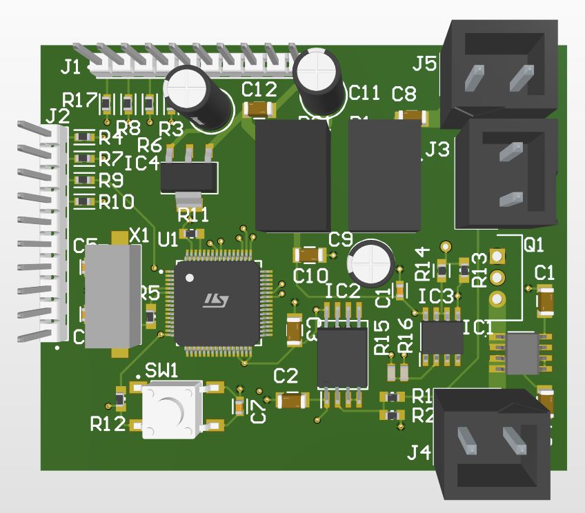

# WATT_BRAKING_CIRCUIT

본 프로젝트는 전기 스쿠터, 전기 자전거 등의 모터에서 발생하는 역기전력으로 인해 배터리로 유입되는 과도한 에너지를 제동 저항으로 소모시켜, 배터리의 과전압 및 손상을 방지하는 회로의 STM32G474RETX 펌웨어입니다.



## 주요 기능

본 펌웨어는 하드웨어 설정에 따라 두 가지 제어 방식 중 하나를 선택하여 동작합니다.

- **PI 제어 모드**: 버스 전압을 실시간으로 측정하여 목표 전압(`V_REF`)을 유지하도록 PWM 듀티를 정밀하게 조절합니다. 부하 변동에 관계없이 안정적인 전압 제어가 필요할 때 사용합니다.
- **히스테리시스 제어 모드**: 설정된 상한 전압을 넘으면 즉시 MOSFET 게이트를 켜고 하한 전압 아래로 내려가면 끄는 빠른 응답성의 제어 방식입니다. 급격한 전압 스파이크에 대응하는 데 효과적입니다.
- **실시간 모니터링**: UART 통신을 통해 현재 버스 전압, 제동 전류, 제어 상태 등을 실시간으로 확인할 수 있습니다.

## 하드웨어 연결

- **J3**: 제어할 주 전원(배터리)의 전압을 연결합니다. (회로도상 `V_BUS`)
- **J4**: 제동 저항(Braking Resistor)을 연결합니다. 저항의 반대편은 시스템의 주 GND에 연결해야 합니다.
- **J5**: 시스템의 주 GND를 연결합니다.

## 펌웨어 구조 및 제어 전략

펌웨어는 회로 기판의 저항 점퍼 설정을 통해 **PI 제어 모드**와 **히스테리시스 제어 모드** 중 하나를 선택하여 동작합니다. 두 모드를 동시에 사용할 수 없습니다.

- **PI 제어 모드 활성화**: **R15 단락(Short) 및 R16 개방(Open)**
- **히스테리시스 제어 모드 활성화**: **R15 개방(Open) 및 R16 단락(Short)**

**경고**: R15와 R16을 동시에 단락시키거나 개방시키면 안 됩니다.

### 1. PI 제어 모드

- **목표**: 버스 전압을 설정된 기준 전압(`V_REF`)으로 안정적으로 유지합니다.
- **동작**:
    1. `TIM7` 타이머가 5kHz(`CTRL_Ts`) 주기로 인터럽트를 발생시킵니다.
    2. 인터럽트 서비스 루틴(`HAL_TIM_PeriodElapsedCallback`) 내에서 `ADC1`으로 측정한 현재 버스 전압을 읽어옵니다.
    3. `BrakePI_Step` 함수를 통해 기준 전압과의 오차를 계산하고, PI 알고리즘에 따라 최적의 PWM 듀티 사이클을 계산합니다.
    4. 계산된 듀티를 `TIM1`의 PWM 채널(`BRAKE_TIM_CH`)에 적용하여 MOSFET 게이트를 구동합니다. 이는 부하에 따라 제동 저항으로 소모되는 전력을 정밀하게 조절합니다.

### 2. 히스테리시스 제어 모드

- **목표**: 전압이 설정된 범위를 벗어날 때 MOSFET을 즉시 켜거나 꺼서 전압을 제어합니다.
- **동작**:
    1. `ADC1`의 아날로그 와치독(AWD)이 하드웨어적으로 버스 전압을 감시합니다.
    2. 전압이 상한 임계값(`AWD_HIGH_CODE`)을 초과하면, `HAL_ADC_LevelOutOfWindowCallback` 콜백 함수가 호출되어 `PA9` GPIO 핀을 즉시 `HIGH`로 만들어 MOSFET을 완전히 켭니다.
    3. 이후 전압이 하한 임계값(`AWD_LOW_CODE`) 아래로 떨어지면, 같은 콜백 함수 내에서 `PA9` 핀을 `LOW`로 만들어 MOSFET을 끕니다.
    4. 이 방식은 소프트웨어 루프보다 반응이 빨라 과도한 전압 오버슈트를 효과적으로 억제합니다.

## 파라미터 설정 및 수정 방법

주요 파라미터는 `Core/Src/main.c` 파일 상단의 `/* USER CODE BEGIN PD */` 섹션에 정의되어 있습니다. 시스템 사양(특히 배터리 전압)이 변경될 경우 이 값들을 수정해야 합니다.

### 1. PI 제어 파라미터

- `V_REF`: PI 제어의 목표 전압입니다. 사용하는 배터리의 정격 충전 전압에 맞춰 설정합니다.
    ```c
    #define V_REF (42.0f) // 예: 42V로 설정
    ```
- `Kp`, `Ki`: PI 제어 게인입니다. 시스템의 응답 특성에 따라 튜닝이 필요할 수 있습니다.
    - `Kp`: 비례 게인. 응답 속도에 영향을 줍니다.
    - `Ki`: 적분 게인. 정상 상태 오차를 제거하는 데 사용됩니다.
    ```c
    static float Kp = 0.05f;
    static float Ki = 0.50f;
    ```

### 2. 히스테리시스 제어 파라미터

- `AWD_HIGH_CODE`, `AWD_LOW_CODE`: 아날로그 와치독의 상/하한 임계값(12비트 ADC 값)입니다.
    - 이 값들은 전압 분배 회로(`1/40`)와 ADC 기준 전압(`3.3V`)을 기준으로 계산됩니다.
    - **계산식**: `ADC 값 = (목표 전압 / 40 / 3.3) * 4095`
    - **예시**: 상한을 45V, 하한을 41V로 변경하고 싶을 경우:
        - `AWD_HIGH_CODE` = `(45.0 / 40.0 / 3.3) * 4095` = `1397`
        - `AWD_LOW_CODE` = `(41.0 / 40.0 / 3.3) * 4095` = `1272`
    ```c
    // (기본값: 43V/41V)
    #define AWD_HIGH_CODE 1334U
    #define AWD_LOW_CODE  1272U
    ```
    **- 중요**: 이 `#define` 값을 변경한 후에는, 반드시 **STM32CubeMX(`.ioc` 파일)**를 열어 `ADC1`의 `Analog Watchdog 1` 설정에서 `High Threshold`와 `Low Threshold` 값을 동일하게 수정하고 코드를 다시 생성해야 합니다.

### 3. 센서 스케일링 팩터

회로의 전압 분배기나 전류 센서가 변경된 경우, `/* USER CODE BEGIN 0 */` 섹션의 물리량 변환 함수를 수정해야 합니다.

- `Code_to_VmV()`: ADC 값을 전압(mV)으로 변환합니다. `40.0f`는 전압 분배 비율입니다.
    ```c
    float v_bus = ((float) code * 3.3f / 4095.0f) * 40.0f;
    ```
- `Code_to_ImA()`: ADC 값을 전류(mA)로 변환합니다. `1.65f`는 전류 센서의 제로 전류 출력 전압(Vcc/2)이고, `0.066f`는 센서의 감도(66mV/A)입니다.
    ```c
    float I = (v - 1.65f) / 0.066f;
    ```

## 실시간 모니터링

UART를 통해 펌웨어의 주요 상태를 실시간으로 확인할 수 있습니다.

- **UART 설정**: 115200 bps, 8-N-1
- **사용법**:
    1. PC와 UART 어댑터를 연결합니다.
    2. 시리얼 터미널 프로그램을 엽니다.
    3. `Q`를 입력하고 Enter 키를 누릅니다.
- **응답 형식**:
    `D,v_mV,i_mA,gpio,pwm,duty
`
    - `v_mV`: 현재 버스 전압 (mV)
    - `i_mA`: 현재 제동 저항으로 흐르는 전류 (mA)
    - `gpio`: 히스테리시스 제어 GPIO(`PA9`)의 현재 상태 (`0` 또는 `1`)
    - `pwm`: PWM 출력 핀의 실시간 논리 상태 (`0` 또는 `1`)
    - `duty`: PI 제어에 의해 계산된 PWM 듀티 (0 ~ 1000, 1000 = 100%)
- **예시 응답**:
    `D,42051,1520,0,1,550`
    - 전압: 42.051V, 전류: 1.52A, 히스테리시스 GPIO 꺼짐, PWM 출력 켜짐, 듀티: 55.0%