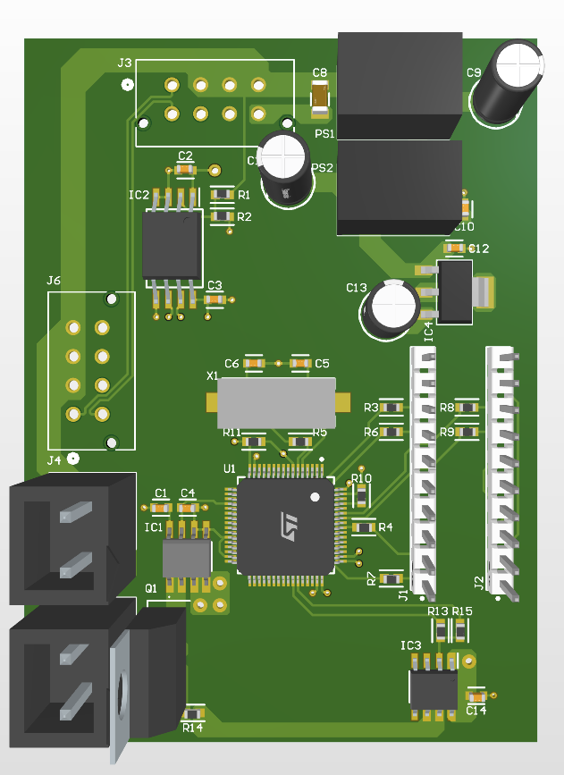

# WATT_BRAKING_CIRCUIT

본 프로젝트는 전기 스쿠터, 전기 자전거 등의 모터에서 발생하는 역기전력으로 인해 배터리로 유입되는 과도한 에너지를 제동 저항으로 소모시켜, 배터리의 과전압 및 손상을 방지하는 회로의 STM32G474RETX 펌웨어입니다.



## 주요 기능

- **디바운싱 히스테리시스 제어**: 설정된 상한 전압을 넘으면 MOSFET 게이트를 켜고 하한 전압 아래로 내려가면 끄는 빠른 응답성의 제어 방식. 노이즈로 인한 오작동 방지를 위해 디바운싱 로직 적용 (연속 4회 샘플 확인)
- **다중 필터 모드**: DEBOUNCING(기본), MA(이동평균), LPF(저역통과필터), RAW 모드 중 선택 가능
- **고속 샘플링**: 500kHz ADC 샘플링 속도로 빠른 전압 변화 감지
- **실시간 모니터링**: CAN 통신을 통해 현재 버스 전압, 제동 전류, 제어 상태 등을 실시간으로 확인 가능

## 하드웨어 연결

- **J3**: 주 전원 및 CAN 통신선의 케이블 연결
- **J6**: INNFOS 모터 케이블 연결
- **J4, J5**: 제동저항 양단(200W 이상의 10옴 권장)

## 펌웨어 구조 및 제어 전략

### 1. 시스템 클럭 및 타이밍
- **메인 클럭**: 170MHz (HSE 8MHz → PLL ×85 ÷4)
- **ADC 샘플링**: 500kHz (TIM6 트리거)
- **ADC 클럭**: 170MHz (SYSCLK 직접 사용)
- **DMA 버퍼**: 16샘플 (Circular 모드, Half/Complete 인터럽트)

### 2. 히스테리시스 제어 (기본 모드: DEBOUNCING)
- **동작 원리**:
  1. TIM6가 500kHz로 ADC1(전압), ADC2(전류)를 트리거
  2. TIM6 Period Elapsed 콜백에서 ADC 값 읽기 및 제어 수행
  3. 디바운싱: 연속 4회 샘플이 임계값을 초과/미만일 때만 MOSFET ON/OFF
  4. GPIO 직접 제어 (`GPIOA->BSRR`) 방식으로 빠른 응답성 확보

- **임계값 설정**:
  - `high_th = 2738` (43.5V) - 이 값 초과 시 MOSFET ON
  - `low_th = 2712` (42.5V) - 이 값 미만 시 MOSFET OFF
  - 디바운싱 카운트: 4 (연속 4회 확인)
  - **⚠️ 중요**: `high_th`, `low_th` 모두 배터리 정격전압보다 높게 설정해야 함
    - 둘 다 배터리전압보다 낮으면 → MOSFET 계속 ON (과열)
    - `high_th > 배터리전압 > low_th`면 → 한번 ON 후 껲지지 않음 (오동작)

### 3. 필터 모드 (CAN으로 전환 가능)
- **DEBOUNCING (0)**: 기본 모드. Raw ADC + 디바운싱으로 제어
- **MA (1)**: 이동평균 필터. DMA 버퍼 절반(8샘플)의 평균 계산
- **LPF (2)**: 저역통과필터. 차단주파수 1kHz, α=0.0478
- **RAW (3)**: 디바운싱 없이 즉시 제어

### 4. DMA 기반 Moving Average (MA 모드)
- `HAL_ADC_ConvHalfCpltCallback`: DMA 버퍼 앞 절반(8샘플) 평균 계산
- `HAL_ADC_ConvCpltCallback`: DMA 버퍼 뒤 절반(8샘플) 평균 계산
- 500kHz 샘플링 시 32μs마다 새로운 평균값 업데이트

## 파라미터 설정 방법

### 실시간 설정 (권장)
CAN 명령을 통해 펌웨어 재빌드 없이 실시간으로 파라미터를 변경할 수 있습니다.
- **필터 모드**: CMD 0x02
- **상한/하한 임계값**: CMD 0x04/0x05
- **LPF 차단주파수**: CMD 0x03

자세한 사용법은 위 "CAN 통신 프로토콜" 섹션 참조.

### 코드 수정 (초기값 변경)
초기 부팅 시 적용되는 기본값은 `Core/Src/main.c`의 `/* USER CODE BEGIN PV */` 섹션에서 수정할 수 있습니다.

```c
// 히스테리시스 임계값 (⚠️ 둘 다 배터리 정격전압보다 높게 설정 필수!)
uint16_t high_th = 2738; // 43.5V
uint16_t low_th = 2712;  // 42.5V

// 필터 모드
FilterType filter_mode = DEBOUNCING;

// 디바운싱 설정
static uint8_t debounce_count = 4;

// LPF 파라미터
uint32_t sampling_freq = 500000;  // 500kHz
uint32_t cutoff_freq = 1000;      // 1kHz
```

**참고**: 
- 디바운싱 카운트는 현재 CAN 명령으로 변경 불가 (코드 수정 필요)
- 센서 스케일링 팩터(`Code_to_VmV`, `Code_to_ImA`)는 코드 수정 필요

## CAN 통신 프로토콜

### 1. CAN ID 할당
- **0x100**: 제어 보드 → PC (데이터 응답)
- **0x099**: 제어 보드 → PC (설정 확인 응답)
- **0x101**: PC → 제어 보드 (명령)

### 2. CAN 설정
- **속도**: 1 Mbps
- **필터**: Standard ID 0x101만 수신 (DUAL 모드)
- **FIFO**: RXFIFO0 사용

### 3. 명령어 상세

모든 명령은 **ID: 0x101**로 전송하며, 응답은 명령 종류에 따라 다릅니다:
- **데이터 요청 (0x01)**: ID 0x100으로 응답
- **설정 명령 (0x02~0x05)**: ID 0x099로 응답

#### 3.1. 데이터 요청 (CMD: 0x01)
현재 전압, 전류, GPIO 상태를 읽어옵니다.

**요청**:
```
ID: 0x101
DLC: 1
Data[0]: 0x01
```

**응답**:
```
ID: 0x100
DLC: 5
Data[0-1]: 전압 (mV, Big-Endian uint16_t)
Data[2-3]: 전류 (mA, Big-Endian uint16_t)
Data[4]: GPIO 상태 (0=OFF, 1=ON)
```

**예시**:
- 응답: `A9 F0 05 DC 01` → 전압: 43504mV (43.5V), 전류: 1500mA (1.5A), GPIO: ON

#### 3.2. 필터 모드 변경 (CMD: 0x02)
실시간으로 필터 모드를 변경합니다.

**요청**:
```
ID: 0x101
DLC: 2
Data[0]: 0x02
Data[1]: 필터 모드 (0=DEBOUNCING, 1=MA, 2=LPF, 3=RAW)
```

**응답**:
```
ID: 0x099
DLC: 2
Data[0]: 0x02
Data[1]: 설정된 필터 모드 (에코백)
```

**예시**:
- 요청: `02 01` → MA 필터로 변경
- 응답: `02 01` → MA 필터 설정 완료

#### 3.3. LPF 차단 주파수 변경 (CMD: 0x03)
저역통과필터의 차단 주파수를 변경합니다 (LPF 모드에서 사용).

**요청**:
```
ID: 0x101
DLC: 5
Data[0]: 0x03
Data[1-4]: 차단 주파수 (Hz, Big-Endian uint32_t)
```

**응답**:
```
ID: 0x099
DLC: 5
Data[0-4]: 요청과 동일 (에코백)
```

**예시**:
- 요청: `03 00 00 07 D0` → 2000Hz로 변경 (0x000007D0 = 2000)
- 응답: `03 00 00 07 D0` → 2000Hz 설정 완료

**참고**: α는 자동 계산됨 (`α = 2πfc / (2πfc + fs)`)

#### 3.4. 상한 임계값 변경 (CMD: 0x04)
히스테리시스 제어의 상한 임계값을 변경합니다.

**⚠️ 중요**: 반드시 배터리 정격전압보다 높게 설정해야 합니다. 낮게 설정하면 MOSFET이 계속 켜져 있거나 오동작합니다.

**요청**:
```
ID: 0x101
DLC: 3
Data[0]: 0x04
Data[1-2]: 상한 임계값 (ADC 코드, Big-Endian uint16_t)
```

**응답**:
```
ID: 0x099
DLC: 3
Data[0-2]: 요청과 동일 (에코백)
```

**예시**:
- 44V로 설정: `ADC 코드 = (44.0/40.0/3.3)×4095 = 2747 = 0x0ABB`
- 요청: `04 0A BB`
- 응답: `04 0A BB` → 44V로 설정 완료

#### 3.5. 하한 임계값 변경 (CMD: 0x05)
히스테리시스 제어의 하한 임계값을 변경합니다.

**⚠️ 중요**: 반드시 배터리 정격전압보다 높게 설정해야 합니다. 낮게 설정하면 MOSFET이 계속 켜져 있거나 오동작합니다.

**요청**:
```
ID: 0x101
DLC: 3
Data[0]: 0x05
Data[1-2]: 하한 임계값 (ADC 코드, Big-Endian uint16_t)
```

**응답**:
```
ID: 0x099
DLC: 3
Data[0-2]: 요청과 동일 (에코백)
```

**예시**:
- 42V로 설정: `ADC 코드 = (42.0/40.0/3.3)×4095 = 2653 = 0x0A5D`
- 요청: `05 0A 5D`
- 응답: `05 0A 5D` → 42V로 설정 완료

### 4. ADC 코드 ↔ 전압 변환

**전압 → ADC 코드**:
```
ADC 코드 = (전압 / 40.0 / 3.3) × 4095
```

**ADC 코드 → 전압**:
```
전압 = (ADC 코드 × 3.3 × 40.0) / 4095
```

**주요 전압값 참조표**:
| 전압 (V) | ADC 코드 (DEC) | ADC 코드 (HEX) |
|---------|---------------|---------------|
| 40.0    | 2525          | 0x09DD        |
| 41.0    | 2589          | 0x0A1D        |
| 42.0    | 2653          | 0x0A5D        |
| 42.5    | 2685          | 0x0A7D        |
| 43.0    | 2716          | 0x0A9C        |
| 43.5    | 2748          | 0x0ABC        |
| 44.0    | 2779          | 0x0ADB        |
| 45.0    | 2843          | 0x0B1B        |

## 개발 환경

- **MCU**: STM32G474RET6
- **IDE**: STM32CubeIDE
- **HAL 버전**: STM32G4xx HAL Driver
- **디버거**: ST-Link

## 문제 해결

### MOSFET이 켜지지 않음
- 임계값 확인: `high_th` 값이 너무 높게 설정되었는지 확인
- GPIO 출력 확인: PA9 핀이 HIGH가 되는지 오실로스코프로 확인

### 노이즈로 인한 오작동
- 필터 모드를 MA 또는 LPF로 변경
- LPF cutoff frequency를 낮춤(기본값 1000Hz), 이 경우 제어의 반응이 느려질 수 있음

### CAN 통신 안됨
- CAN 버스 종단저항 확인 (120Ω × 2)
- 필터 설정 확인: 0x101만 수신하도록 설정됨
- Global Filter 설정 확인